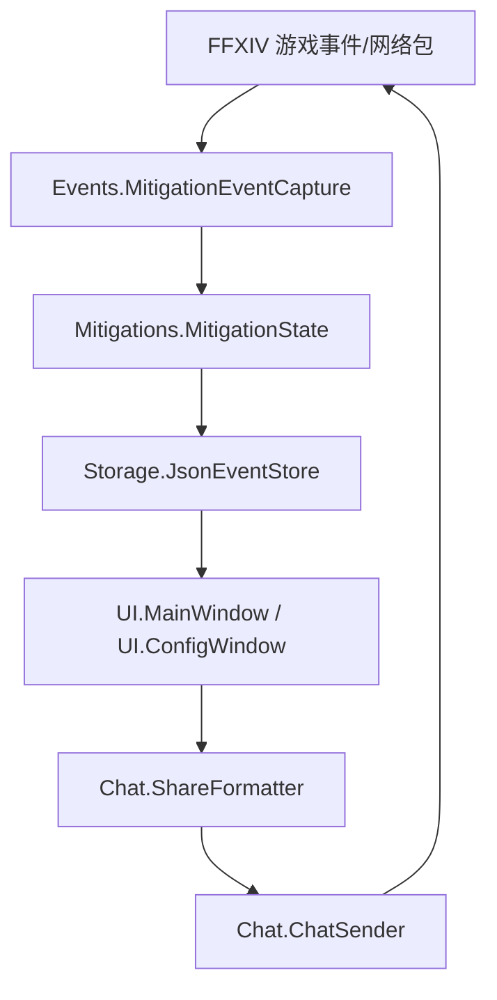

# 架构设计

## 总体架构

## 技术栈
- **插件框架:** Dalamud（CN SDK）
- **语言:** C#
- **UI:** ImGui
- **持久化:** JSON（插件配置目录下文件）

## 核心流程（简述）
1. `MitigationEventCapture` 通过 Dalamud Interop Hook 捕获受伤/减伤相关网络事件，并将事件写入/更新 `MitigationState`。
2. `MitigationState` 维护“命中瞬间有效的减伤”与“可用未交”的推算逻辑，并产出用于 UI/分享的结构化记录（含致死标注、顶减伤覆盖记录）。
3. `JsonEventStore` 将战斗会话与受伤事件落盘到 `mitigation-police.json`，并提供 UI 侧查询与筛选所需的摘要/加载能力。
4. `MainWindow` 提供复盘与分享入口；`ConfigWindow` 提供发送权限与自动通报开关。
5. `ShareFormatter` 生成面向小队频道的多行文本；`ChatSender` 负责执行 `/p` 发送。

## 重大架构决策
当前版本未引入独立 ADR 索引；如未来出现架构级变更（例如新增 IPC/外部服务），应在变更方案包 `how.md` 中补充 ADR，并在此处追加索引。
